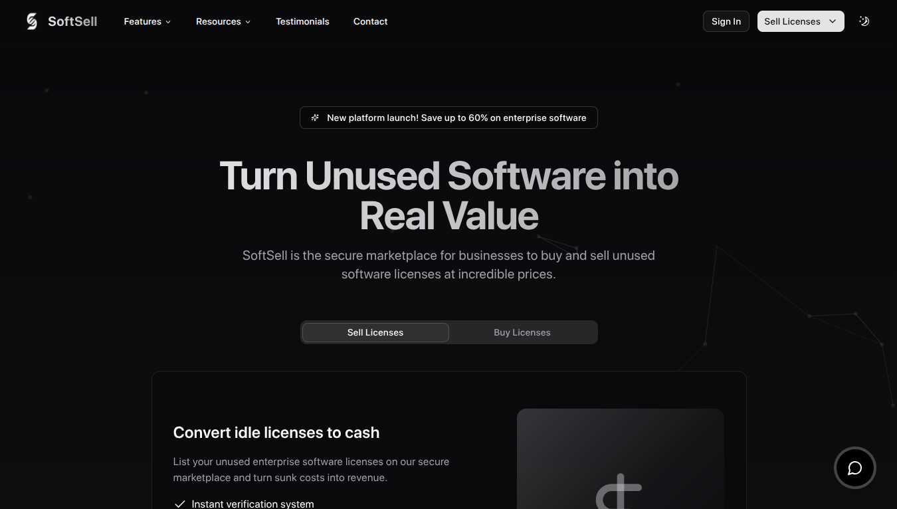
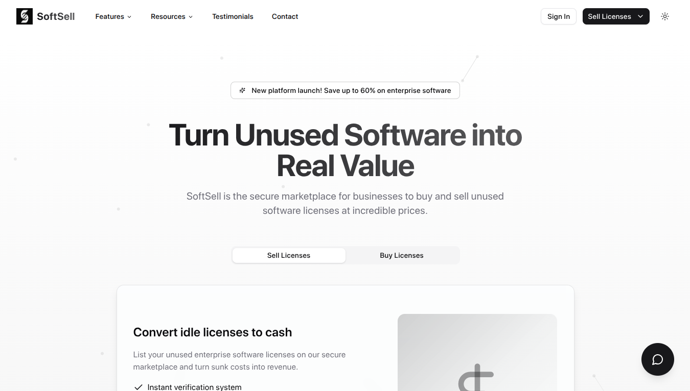

# 
 SoftSell

The premier marketplace for software license resale

  
  &nbsp; &nbsp; &nbsp;
  

## 🌟 Overview

SoftSell is a cutting-edge SaaS platform designed to help users securely sell their unused software licenses. With a sleek UI, intuitive flow, and AI-powered assistance, SoftSell offers a seamless experience for license valuation and selling.

Visit our platform: [https://soft-sell-project.vercel.app/](https://soft-sell-project.vercel.app/)

## ✨ Key Features

- 🔐 **Secure License Uploads** - Safely upload your unused software licenses
- 💰 **Instant Valuations** - Get real-time market-based valuations
- 🤖 **AI Chat Assistant** - Powered by Google's Gemini AI model
- 🌓 **Dark/Light Theme** - Beautiful interface in both modes
- 🔄 **Interactive UI Elements** - Motion animations and tilt effects
- 📱 **Fully Responsive** - Optimized for all devices

## 🛠️ Technology Stack

### Core Technologies
- **Next.js 15** - React framework with App Router
- **TypeScript** - For type-safe code
- **Tailwind CSS 4** - For styling with Typography plugin
- **Vercel AI SDK** - For AI chat integration

### UI Components & Libraries
- **Shadcn UI** - Accessible UI components
- **Framer Motion** - Animations and transitions
- **TSParticles** - Background particle effects
- **VanillaTilt** - Interactive tilt effects on cards

### AI Integration
- **Google Gemini AI** - Powers the chat assistant
- **@ai-sdk/google** - Integration of the Gemini model
- **@ai-sdk/react** - React hooks for AI interaction

## 🧠 AI Implementation

The platform features an AI chat assistant powered by Google's Gemini model, enabling users to:
- Get instant answers about license valuation
- Learn about the selling process
- Receive personalized recommendations
- Get support in real-time

The implementation leverages the Vercel AI SDK and Google's Gemini API to render markdown responses beautifully in the chat interface.

## 📐 Architecture

SoftSell follows a modern web architecture:

- **App Router** - Next.js app directory structure
- **Server Components** - For improved performance and SEO
- **Client Components** - For interactive UI elements
- **Responsive Design** - Tailwind's mobile-first approach

## 📝 Components

- **Hero Section** - Engaging landing section with call-to-action
- **How It Works** - Interactive step-by-step explanation
- **Why Choose Us** - Feature highlights with tilt effects
- **Testimonials** - Social proof from satisfied customers
- **Chat Widget** - AI-powered assistant with markdown support
- **Contact Form** - For user inquiries
- **Navigation** - Responsive navbar with theme toggle

## 📄 License

Copyright © 2025 SoftSell. All rights reserved.

---

  <a href="https://soft-sell-project.vercel.app/">Visit SoftSell</a> •
  <a href="mailto:contact@softsell.example.com">Contact</a> •
  <a href="https://soft-sell-project.vercel.app/#why-choose-us">Why Choose Us</a>

